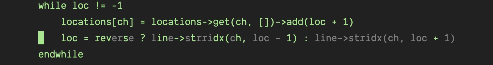

# fFtT.vim

Characters that are reachable with a single jump are highlighted, while others are dimmed. This enhancement improves the accuracy of navigation using `f`, `F`, `t`, and `T` commands. Additionally, you can provide a numerical prefix (e.g., `3f`), which will only highlight characters that occur the third time to the right of the cursor, while others are dimmed.

This plugin does not remap keys or alter the behavior of commands. It solely focuses on highlighting relevant characters without making any changes to the default key mappings. The code consists of less than 100 lines, with explanatory comments.



## Requirements

- Vim 9.0 or higher

## Installation

Install it via [vim-plug](https://github.com/junegunn/vim-plug).

<details><summary><b>Show instructions</b></summary>
<br>
  
Using vim9 script:

```vim
vim9script
plug#begin()
Plug 'girishji/fFtT.vim'
plug#end()
```

Using legacy script:

```vim
call plug#begin()
Plug 'girishji/fFtT.vim'
call plug#end()
```

</details>

Install using Vim's built-in package manager.

<details><summary><b>Show instructions</b></summary>
<br>
  
```bash
$ mkdir -p $HOME/.vim/pack/downloads/opt
$ cd $HOME/.vim/pack/downloads/opt
$ git clone https://github.com/girishji/fFtT.vim.git
```

Add the following to your $HOME/.vimrc file.

```vim
packadd fFtT.vim
```

</details>

## Configuration

The appearance of characters that are unreachable within one jump is determined by the highlight group `FfTtSubtle`, which is linked to the `Comment` group by default.
